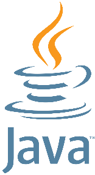
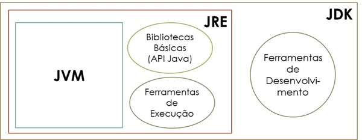

# Introdução

## Um Pouco de História

Java é uma linguagem de programação popular, que começou a ser desenvolvida na década de 90 por uma equipe de programadores, chefiada por **James Gosling**, na empresa **Sun Microsystems**. Um dos desenvolvedores nomeou a linguagem de **OAK** (carvalho), pois, enquanto pensava numa estrutura de diretórios para a linguagem, observava pela janela um carvalho, mas esse nome já estava registrado. O nome “**Java**” surgiu inspirado no café que o grupo de desenvolvimento consumia, em uma cafeteria local, sendo o nome da terra de origem do café: Ilha de Java. O café também foi usado na criação da logomarca da linguagem.

Em 2006 a **Sun Microsystems** liberou a maior parte do Java como um software livre sob os termos da GNU GPL (*General Public License*).

Em 2008 a **Oracle Corporation** adquire o Java ao adquirir a empresa **Sun Microsystems**.

## Principais Características e Vantagens do Java

- Suporte à Programação Orientada a Objetos (POO) que fornece uma estrutura clara aos programas e permite que o código seja reutilizado, reduzindo os custos de desenvolvimento;
- Multiplataforma (independência de plataforma). WORA – Write Once, Run Anywhere (escreva uma vez, execute em qualquer lugar);
- Linguagem compilada e interpretada;
- Fortemente tipada;
- Recursos de Rede – possui extensa biblioteca de rotinas que facilitam a cooperação com protocolos TCP/IP, como HTTP e FTP;
- É seguro, rápido e poderoso, permitindo executar programas via rede com restrições de execução;
- Tem um enorme apoio da comunidade (dezenas de milhões de desenvolvedores);
- Ainda tem uma grande procura no mercado de trabalho atual;
- Como Java é próximo de C++, torna mais fácil para os programadores mudarem para Java ou vice-versa;
- Facilidades de Internacionalização - Suporta nativamente caracteres Unicode;
- Desalocação de memória automática por processo de coletor de lixo;
- É distribuída com um vasto conjunto de bibliotecas;
- Carga Dinâmica de Código;
- Entre outras...

## Principais Ambientes/Plataformas, Siglas... no Java

Quando alguém começa a procurar por Java na internet, principalmente para fazer download da ferramenta, essa pessoa se depara com uma sopa de letrinhas, ambientes/plataformas, versões, siglas... O que acaba virando um transtorno para os novatos na linguagem. 

Nessa seção você começara a diferenciar esses termos.

### Java SE (Standard Edition)

O Java Standard Edition, é um ambiente/plataforma Java abstrato, que fornece um conjunto de tecnologias para o desenvolvimento de software, contendo todo o ambiente necessário para a criação e execução de aplicações voltadas para computador desktop, servidor do grupo de trabalho ou qualquer outra máquina que possua o JRE instalado, que será descrito a seguir. O Java SE possuí os recursos básicos do Java e é por onde deve-se iniciar o aprendizado.

### Java EE (Enterprise Edition)

O Java Enterprise Edition, é um ambiente/plataforma Java mais robusto, possuindo mais recursos que o Java SE, em outras palavras, o Java EE é mais completo que o Java SE. O Java EE é mais usado para aplicações de larga escala, sistemas distribuídos, aplicações corporativas voltadas para web, servidores de aplicação, entre outros. O Java EE permite o desenvolvimento de aplicações com uma grande quantidade de usuários, permitindo o desenvolvimento de aplicações escaláveis, robustas e multicamadas.

### Java ME (Micro Edition)

O Java Micro Edition, é um ambiente/plataforma que permite o desenvolvimento de aplicações para dispositivos móveis e embarcados/embutidos – Internet das Coisas (IoT – Internet of Things), como:  PDAs, decodificadores de TV, impressoras, microcontroladores, sensores etc. É usado, principalmente, para dispositivos com recursos limitados, sendo um subconjunto do Java SE. 

### JDK – Java Development Kit

O JDK – Java Development Kit (Kit de Desenvolvimento Java) é uma coleção de ferramentas e bibliotecas usadas para desenvolver aplicações na linguagem Java. Possui ferramentas para compilar, depurar, gerar documentação, executar códigos em Java. O JDK inclui, na sua instalação, o JRE que por sua vez inclui a JVM (veja as descrições a seguir). 

Portanto, para desenvolver aplicações usando a linguagem Java, será necessário baixar e instalar o JDK compatível com a versão do Java que você deseja usar e com o seu sistema operacional. Nessa apostila não será abordado a instalação e configuração do JDK. Existem diversos tutoriais/vídeos, na internet, sobre esse tópico, não sendo um processo complexo.

### JRE – Java Runtime Environment

O JRE – Java Runtime Environment (Ambiente de Execução Java), é o ambiente necessário para execução de aplicações desenvolvidas em Java. Esse ambiente inclui a JVM (descrita a seguir), bibliotecas e outros componentes necessários para a correta execução de aplicações desenvolvidas na linguagem Java, fornecendo acesso a recursos do sistema como: memória, dependências, arquivos, entre outros.

O JRE funciona acima do sistema operacional, fornecendo recursos adicionais necessários para a execução da aplicação desenvolvida em Java. Portanto, para que uma aplicação Java funcione em uma determinada máquina, essa deve ter o JRE compatível com o seu sistema instalado.

### JVM – Java Virtual Machine

A JVM – Java Virtual Machine (Máquina Virtual Java) é o programa responsável por carregar e executar as aplicações desenvolvidas e compiladas na linguagem Java. A JVM interpreta os bytecodes[^1] em código executável de máquina. É a JVM que permite que as aplicações escritas em Java, possam ser executadas em qualquer plataforma de hardware e software, desde que tenham uma versão da JVM instalada. Em outras palavras a JVM é um computador abstrato (virtual) que, além de interpretar o bytecode, executa tarefas como: otimizações internas, coleta de lixo, segurança, entre outras. 

### Estrutura

Veja, na figura a seguir, como fica a estrutura das ferramentas JDK, JRE e JVM, conforme descrito acima.

## IDE’s para Desenvolver em Java

IDE – *Integrated Development Environment* (Ambiente de Desenvolvimento Integrado) é uma aplicação que fornece um conjunto de recursos abrangentes para desenvolvimento de software de maneira mais eficiente. Entre esses recursos, os mais comuns são: editor de código fonte, compilador, depurador (debugger), realce de sintaxe e gerenciamento de projetos. Muitos IDE’s modernos possuem também um navegador de classes, um navegador de objetos, um diagrama de hierarquia de classes, entre outros. Esse conjunto de ferramentas estão integradas em uma única interface, facilitando o processo de desenvolvimento.

Os exemplos dessa apostila serão mostrados a partir da IDE Eclipse. Mas você não terá dificuldade em adaptar para as outras IDE’s existentes no mercado. Veja algumas IDE’s existentes para o desenvolvimento de aplicações Java:

### IntelliJ IDEA

Desenvolvido pela **JetBrains**, possui duas distribuições: **IntelliJ IDEA Ultimate**, uma distribuição comercial e proprietária e **IntelliJ IDEA Community Edition**, software de código aberto sujeito à licença Apache 2.0. Possui sugestões de código, recursos avançados de refatoração, suporte para estruturas Java populares (Spring, Hibernate, Maven) além de integração com ferramentas de build e implantação.

### Eclipse

Desenvolvido por **Eclipse Foundation**, o **Eclipse** é uma IDE clássica, gratuita e de código aberto. É altamente adaptável, através de plug-ins, permitindo adaptar às suas necessidades específicas. Possui uma grande comunidade ativa, que contribuem para o seu crescimento contínuo.  É um ambiente moderno disponível para desktop e nuvem (**Eclipse Che**). 

### NetBeans

O **NetBeans** já foi a IDE oficial para o desenvolvimento em Java. Já esteve sob responsabilidade das empresas **Sun Microsystems** e **Oracle**. Em 2016 tornou-se um projeto de código aberto mantido pela comunidade **Apache**, passando a ser chamado **Apache NetBeans**. Esse IDE se destaca por possuir uma interface de usuário simples e recursos educativos, facilitando o seu uso e diminuindo a curva de aprendizado. Possui depurador eficiente facilitando a localização e correção de bugs. Possui também ferramentas integradas para refatoração de código, além de ferramentas visuais para construção de interface gráfica do usuário (GUI – Graphical User Interface)

### Visual Studio Code

Desenvolvido pela **Microsoft**, o **Visual Studio Code**, ou simplesmente **VS Code**, é um software livre e de código aberto, lançado sobre a licença MIT. Seu código fonte encontra-se no **GitHub**. É um editor de código leve, mas extremamente poderoso. Possui suporte para desenvolvimento em Java através da instalação de extensões. Possui terminal integrado, o que facilita a execução de comandos do SO sem sair da IDE. Inclui suporte para depuração, controle de versionamento **GIT** incorporado, realce de sintaxe, refatoração e complementação inteligente de código. É customizável, permitindo mudar o tema do editor, preferências, teclas de atalho, entre outros. 

[^1]: **Bytecodes** – código compacto, portátil e independente de plataforma que atua como um intermediário entre código-fonte de alto nível e código de máquina de baixo nível
