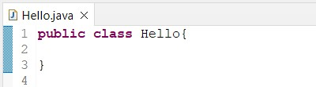
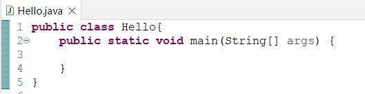
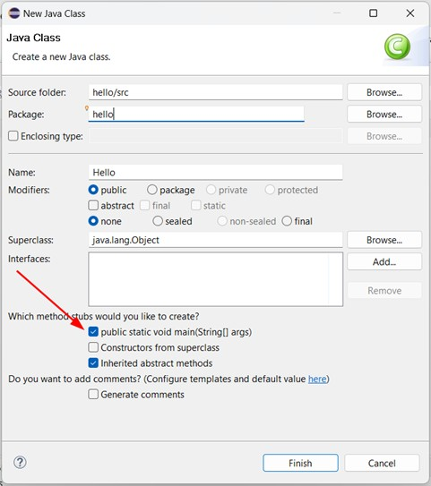
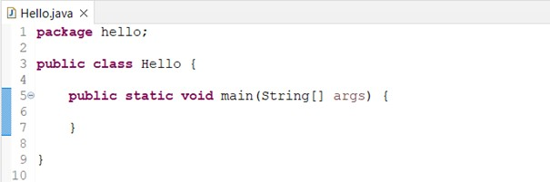

# Estrutura Básica de Um Programa Java

No Java, todo programa roda em uma classe. O conceito de classe será discutido em outro material relacionado a **POO – Programação Orientada a Objetos**. Um programa Java, pode ser desenvolvido usando um ou mais arquivos de código fonte com a extensão “**.java**”. Em cada arquivo precisa ser declarado uma única classe pública com o mesmo nome do arquivo, considerando inclusive a caixa da fonte (maiúsculas/minúsculas). No exemplo ilustrado na próxima imagem, temos o arquivo `Hello.java` e a classe pública `Hello` declarada nesse arquivo. Essa é a classe principal do programa.

Os termos `public class` são obrigatórios e serão explicados em outro material de **POO – Programação Orientada a Objetos**. 

Para ser executado, todo programa Java precisa ter um método[^1] principal (`main`). Quando a JVM inicia, ela procura por esse método para iniciar a execução do programa. Esse é o ponto de entrada na execução de um programa Java. 

No Java existe um padrão para escrever o método `main`: ele deve ser definido como público (`public`), todos têm acesso a ele. Deve ser definido como (`static`), que indica que o método pertence a classe. Esse método não irá retornar nenhum valor (`void`). Além disso esse método pode receber uma lista de textos (`String[]`), passados na linha de comando e recebidos no parâmetro `args`. Ficou um pouco confuso, não preocupe, à medida que você for estudando e aprendendo sobre os detalhes da linguagem Java e dos conceitos de **POO – Programação Orientada a Objetos**, esses pontos ficarão mais claros. Além disso, a maioria das IDE’s, possuem atalhos para gerar esse método automaticamente, facilitando o trabalho. No caso do Eclipse, ao criar uma classe, basta marcar a opção para criar o método `main` automaticamente. Veja a imagem a seguir.

Outro item que pode aparecer na estrutura básica de um arquivo Java, é o nome do pacote (`package`) a que ele pertence. 

Essa é a estrutura básica de um programa Java, mas, por enquanto, ela não faz absolutamente nada. Para que o programa faça algo, temos que escrever algum código entre as (dentro das) chaves `{ }`, do método `main`. É o que você irá aprender nos próximos tópicos dessa apostila.

[^1]: **Método** – função dentro de (pertecente a) uma classe.
