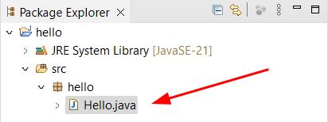

# Criar Um Projeto Java no Eclipse

Nesse tópico, você aprenderá os princípios básicos para criar um projeto Java no Eclipse no ambiente Windows. Tenha em mente, que alguns detalhes serão omitidos, para simplificar o processo nesse momento. Quando se fizerem necessários (se for o caso) abordaremos novos detalhes. Como dito anteriormente, usaremos o Eclipse no ambiente Windows, mas os conceitos aqui discutidos, não diferem muito em outros IDE’s nem em outros ambientes. 

## Workspace no Eclipse

O workspace (espaço de trabalho) é um diretório (pasta) no seu disco, onde o Eclipse irá armazenar suas configurações de ambiente, suas preferências e, principalmente, os projetos criados e seus recursos. Você pode criar vários workspaces, com diferentes configurações, no Eclipse, mas só poderá ter um aberto de cada vez. 

Por padrão, o Eclipse usa o diretório “**C:\Users\nomeUsuario\eclipse-workspace**”, substituindo “**nomeUsuario**” pelo nome do seu usuário no Windows. Mas você pode escolher qualquer diretório no seu computador. 

Ao abrir o Eclipse, ele solicitará que você defina um diretório para ser usado como espaço de trabalho (workspace). Veja a próxima imagem.

Ao clicar no botão  do lado direito da caixa de seleção do espaço de trabalho, será aberta uma lista com os últimos espaços de trabalho usados. Você pode também clicar no botão  e selecionar uma outra pasta no seu computador para ser usada como espaço de trabalho.

Você pode também selecionar a opção para definir esse espaço de trabalho como padrão (default) . Caso você marque essa opção, essa janela não abrirá todas as vezes que você iniciar o Eclipse. Mas você ainda poderá alterar o espaço de trabalho dentro do Eclipse.

Depois de ter feito todas as opções desejadas, basta clicar no botão  e o Eclipse será aberto. 

## A Janela do Eclipse e as Perspectivas

A próxima imagem mostra uma janela padrão do Eclipse para trabalhar com Java.

O Eclipse trabalha com perspectivas e, dependendo da versão do Eclipse que você instalou, a janela inicial pode estar muito diferente da janela apresentada acima. Caso sua janela esteja muito diferente, mude a perspectiva para trabalhar com o Java, selecionando a opção “**Perspective\Open Perspective\Other...**” do menu “**Window**”, veja a imagem.

Você pode também clicar no botão “**Open Perspective**” no canto superior direito da janela do Eclipse.

Com qualquer uma das opções, a caixa de diálogo “**Open Perspective**” será aberta. Clique na opção “**Java**” ou “**Java (default)**” e no botão “**Open**”.

Depois de já ter usado uma perspectiva, você poderá ativá-la novamente através do seu botão no canto superior direito da barra de ferramentas.

Caso você altere o layout de uma perspectiva e queira retornar para o seu layout padrão, basta selecionar a opção “**Perspective\Reset Perspective...**” do menu “**Window**” para que a perspectiva volte para o seu layout padrão.

## Criar Um Novo Projeto

Existe algumas formas de criar um projeto Java no Eclipse. Como você acabou de abrir um novo espaço de trabalho e ele ainda não contém nenhum projeto, a guia “**Package Explorer**” (Explorador de Pacotes) contém uma lista de ações para adicionar um novo projeto no espaço de trabalho. Entre essas ações está a opção “**Create a Java project**” para criar um projeto Java. 

Outra opção é através da opção “**New\Java Project**” do menu “**File**”.

Você pode ainda, clicar no triângulo do botão “**New**” (primeiro botão da barra de ferramentas) e selecionar a opção “**Java Project**”.

Todas essas opções abrirão a caixa de diálogo “**New Java Project**”.

Nessa janela, digite o nome do projeto, escolha a versão do Java a ser usada, desmarque a opção para criar módulo (por enquanto não trabalharemos com módulos) e clique no botão “**Finish**”. 

Um novo projeto Java será criado. Veja o projeto criado na guia “**Package Explorer**”.

## Cria Uma Classe no Projeto

Para criar uma classe em um determinado projeto, o primeiro passo é selecionar o projeto clicando no seu nome na guia “**Package Explorer**”. Depois selecione a opção “**New\Class**” do menu “**File**”:

Ou clique no triângulo do botão “**New**”, na barra de ferramentas, e escolha a opção “**Class**”:

Qualquer uma das opções que você escolher, abrirá a caixa de diálogo “**New Java Class**”. A caixa de texto “**Package:**” já deve estar preenchida com o mesmo nome do projeto “**hello**” (todo em minúsculo) nesse exemplo. Por enquanto, não vamos preocupar muito com o pacote, trataremos sobre esse assunto mais pra frente no curso.

Preencha o nome da classe, caixa de texto “**Name:**” com o nome “**Hello**” (primeira letra de cada palavra maiúscula e o restante em minúsculas – trataremos sobre as convenções de nomenclatura mais para a frente). Marque a caixa de seleção para criar o método “**main**” e clique no botão “**Finish**”. 

Na pasta “**src**” do seu projeto, será criado uma pasta com o nome do pacote (“**hello**” nesse exemplo) e nessa pasta será criado o arquivo “**Hello.java**”. Veja essa arquitetura na guia “**Package Explorer**”:

Esse arquivo será aberto na guia do editor de código. Esse arquivo já terá a classe “**Hello**” e o método “**main**” declarados (caso você tenha marcado a caixa de seleção para criação do método):

Pronto, você já possui um projeto, uma classe e o método “**main**”. Mas como já foi dito anteriormente, se você mandar executar esse projeto não irá acontecer nada. No próximo tópico você aprenderá como definir comandos para apresentar mensagens na janela do console. 