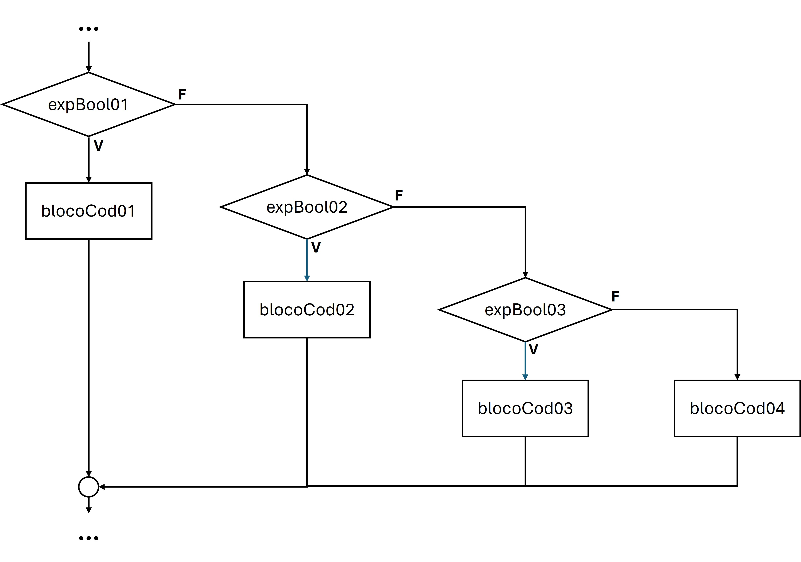

# Estruturas de Decisão / Condicionais 

As Estruturas de Decisão ou Estruturas Condicionais, são comandos que permitem ao programador definir se um determinado bloco de código será executado com base em determinadas condições. Esse é um conceito fundamental no desenvolvimento de sistemas e está presente na maioria das linguagens. 

## Simples

As estruturas condicionais simples são estruturas de controle que permitem ao programador definir um bloco de comandos que só será executado se uma determinada condição for satisfeita (verdadeira). Veja essa estrutura no fluxograma a seguir.


O bloco de código “**blocoCod**” só será executado se a expressão booleana “**expBool**” for verdadeira. Caso a expressão booleana “**expBool**” for falsa, o programa segue o fluxo normal do código sem executar o bloco de código “**blocoCod**”.

### Sintaxe

```java
if(expBool) {
	// blocoCod
}
Exe
```

### Exemplo

```java
if(idade >= 18) {
	System.out.println("Você é maior de idade!!!");
}

```

## Composta

As estruturas condicionais compostas permitem definir um bloco de código a ser executado caso uma determinada condição seja satisfeita (verdadeira) e um outro bloco de código que será executado caso a condição não seja satisfeita (falsa). Veja o fluxograma dessa estrutura a seguir.


A expressão booleana “**expBool**” será avaliada e caso seja satisfeita (verdadeira) o bloco de código “**blocoCod01**” será executado. Caso a expressão boolena “**expBool**” não seja satisfeita (falsa) o bloco de código “**blocoCod02**” será executado.

### Sintaxe

```java
if(expBool){
	//blocoCod01
} else {
	//blocoCod02
}
```

### Exemplo

```java
if(idade >= 18) {
	System.out.println("Você é maior de idade!!!");
} else {
	System.out.println("Você é menor de idade!!!");
}
```

## Encadeadas / Aninhadas

As estruturas condicionais encadeadas (aninhadas) avaliam mais de uma expressão booleana. Caso a primeira expressão booleana seja falsa, a segunda expressão booleana será avaliada, e assim por diante até que não tenha mais expressões booleanas a serem avaliadas. Ainda pode conter, assim como na estrutura condicional composta, um bloco de código que será executado caso nenhuma das expressões booleanas tenham sido avaliadas como verdadeiras. Veja o fluxograma da estrutura condicional encadeada na próxima figura.



### Sintaxe

```java
if(expBool01) {
	//blocoCod01
} else if (expBool02) {
	//blocoCod02
} else if (expBool03) {
	//blocoCod03
} else {
	//blcoCod04
}
```

### Exemplo

```java
if(nota < 60) {
	System.out.println("Insuficiente");
} else if(nota < 70) {
	System.out.println("Regular");
} else if(nota < 80) {
	System.out.println("Bom");
} else if(nota < 90) {
	System.out.println("Muito Bom");
} else {
	System.out.println("Excelente");
}
```

## Múltipla Escolha

Nas estruturas condicionais de múltipla escolha, uma expressão booleana é avaliada e definida uma lista de possíveis valores para essa expressão. Caso seja um dos valores listados o bloco de código desse valor será executado. No Java, se você não interromper, com a palavra reservada “break”, após a execução de um determinado bloco de código, todos os blocos de código abaixo da opção selecionada serão executados também. Você pode optar por usar o “break”, ou não, dependendo da lógica do que você está desenvolvendo. Veremos um exemplo usando o “break” e um não usando-o.  Veja o fluxograma da estrutura condicional encadeada na próxima figura.


Caso a expressão seja avaliada com o primeiro valor o bloco de código “**blocoCod01**” será executado e, se houver a palavra reservada “**break**” (fluxo com linha sólida) a estrutura condicional de múltipla escolha será encerrada. Mas se não houver a palavra reservada “**break**” (fluxo com linha tracejada) os próximos blocos de código “**blocoCod02**”, “**blocoCod03**” ... serão executados até que um “**break**” seja encontrado. Caso a expressão não seja avaliada com o primeiro valor, a estrutura condicional passa para os próximos valores sucessivamente. Caso a expressão não seja avaliada com nenhum dos valores listados, o bloco de código default “**blocoCod04**”, que é opcional, será executado.

### Sintaxe

```java
switch (expressao) {
case 1:
	//blocoCod01
	break; //opcional
case 2:
	//blocoCod02
	break; //opcional
case 3:
	//blocoCod03
	break; //opcional
default: 
	//blocoCod04;
}
```

### Exemplo

Exemplo sem o “**break**”

```java
switch (plano){
case "ouro": 
	System.out.println("canal X, canal Y, canal Z");
case "prata":
	System.out.println("canal M, canal N, canal O");
case "bronze":
	System.out.println("canal F, canal G, canal H");
default:
	// plano básico
	System.out.println("canal A, canal B, canal C");
}
```

Exemplo com o “**break**”

```java
switch (posicao){
case 1: 
	System.out.println("Medalha de OURO");
	break;
case 2:
	System.out.println("Medalha de PRATA");
	break;
case 3:
	System.out.println("Medalha de BRONZE");
	break;
default:
	System.out.println("Medalha honra ao mérito");
}
```
